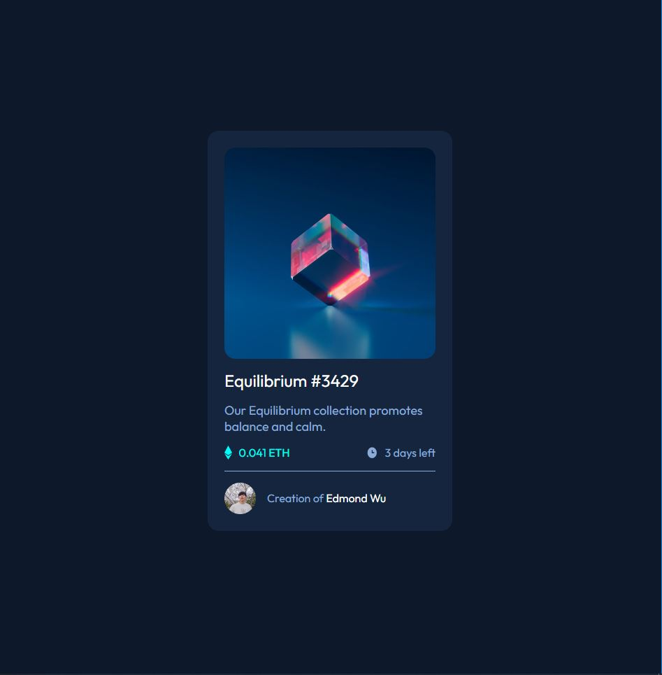

# Frontend Mentor - NFT preview card component solution

This is a solution to the [NFT preview card component challenge on Frontend Mentor](https://www.frontendmentor.io/challenges/nft-preview-card-component-SbdUL_w0U). Frontend Mentor challenges help you improve your coding skills by building realistic projects. 

## Table of contents

- [Overview](#overview)
  - [The challenge](#the-challenge)
  - [Screenshot](#screenshot)
  - [Links](#links)
- [My process](#my-process)
  - [Built with](#built-with)
  - [What I learned](#what-i-learned)
- [Author](#author)

**Note: Delete this note and update the table of contents based on what sections you keep.**

## Overview

### The challenge

Users should be able to:

- View the optimal layout depending on their device's screen size
- See hover states for interactive elements

### Screenshot

### Links

- Live Site URL: [https://edmond-wu-9.github.io/nft_card_component/]

## My process

Using HTML and CSS, I created a fake NFT Component Card which holds an image, price, description, title, and acknowledgement.

### Built with

- Semantic HTML5 markup
- CSS custom properties
- Flexbox
- Mobile-first workflow

### What I learned

I learned the use of active states such as :hover. However,I wasnt able to complete adding a background tint of cyan to the NFT photo. 

## Author

- Website - [Edmond Wu]
- Frontend Mentor - [@Edmond-Wu-9](https://www.frontendmentor.io/profile/yourusername)